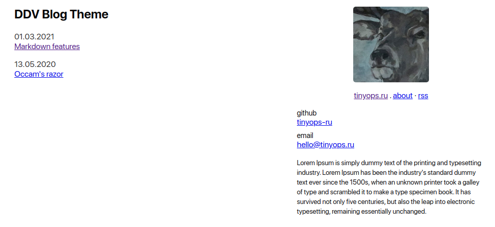

# Theme for Zola static site generator

Inspired by [Drew DeVault's blog](https://drewdevault.com/).



- Configurable links for right menu: email, github, instagram, twitter.
- No pagination.

## Getting started

```shell
git clone https://github.com/tinyops-ru/ddv-theme.git themes/ddv
```

Edit `config.toml`:

```toml
theme = "ddv"
```

### How to build

```shell
zola build --output-dir docs
```

